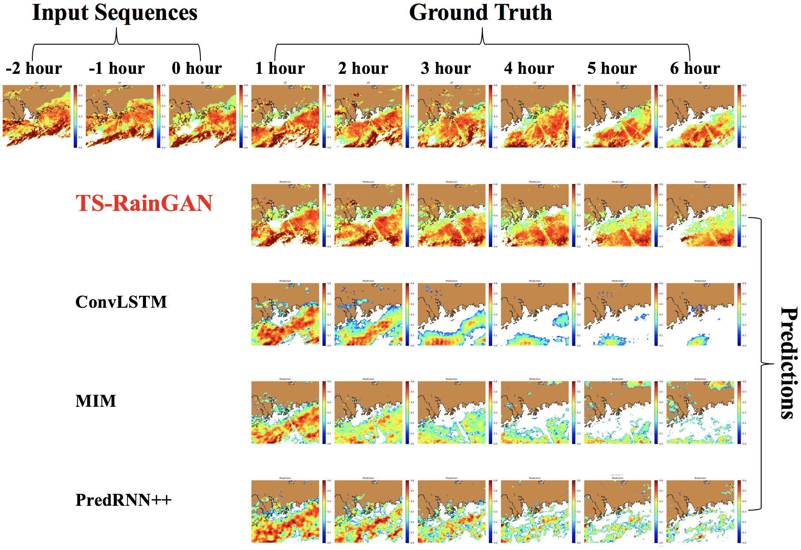

# TS-RainGAN

We present a novel architecture for precipitation nowcasting, Task-segmented Recurrent Generative Adversarial Network (TS-RainGAN), which shows state-of-the-art performance in 6-hour precipitatin nowcasting.

**Figure 1:** *The detail maintenance in the predicted radar reflectivity image (with lead time of 1 hour) by the TS-RainGAN, the ConvLSTM, the PredRNN++, and the MIM during the rainfall event in 27 April 2012.*

**Figure 2:** *Performance comparison of the 6-hour nowcasting by the TS-RainGAN, the ConvLSTM, the PredRNN++, and the MIM. during the selected rainfall events on 27 April 2012.*

## Install the following packages on CentOS

All code was developed and tested on 2 * RTX8000 the following environment.

- Python 3.7
- opencv3
- scikit-image
- numpy
- tensorflow>=1.15
- cuda>=10.0.130
- cudnn>=7.6

The training data is HKO Dopper Radar reflectivity data, provided by the Hong Kong Observatory.

Please contact Email: rwangbp@connect.ust.hk if you have any concerns using this code.

@copyright statement: The code in this project is written by Rui Wang, currently postgraduate student at HKUST supervised by professor Jimmy Fung. This code is only for testing purpose by reviewers. Any actions of copying for publication or commercial usage before the formal publication of this code related paper will be considered as copyright violation.

# Acknowledgment
We thank the HKO for providing the observational radar products. This work is supported by AoE/E-603/18 and the National Air Pollution Control Program of the National Key Research & Development Plan 2018YFC0213902.

